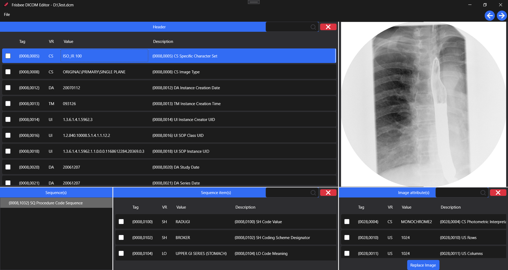

### Frisbee DicomEditor
This is an attempt to build a simple DICOM editor using fo-dicom. 
WPF and HandyControl is used to build the user interface. 
The tags as well as the pixel data can be updated. Also tags can be deleted.
The following features are in wish list:

- Adding tags
- Display multi-frame images
- etc

Suggestions from community are welcome. Also test with different kind of DICOM images is appreciated.

``Note: Tested only with 64 bit Windows. Build with x64 build configuration``